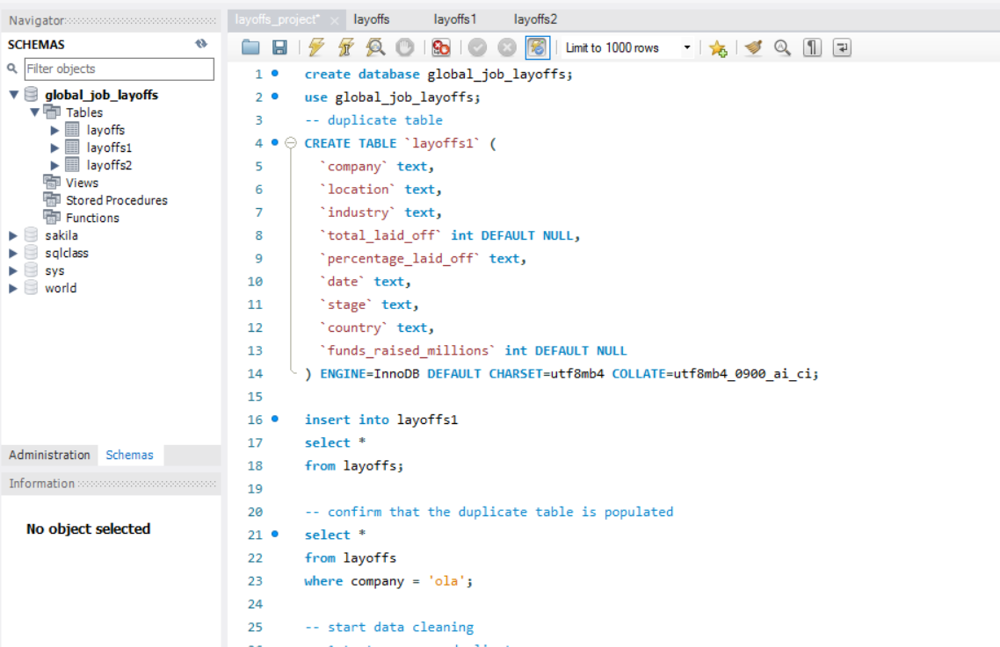
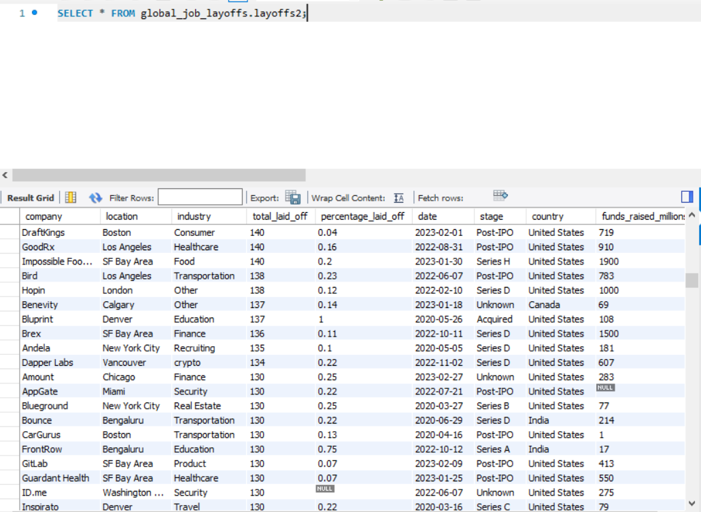
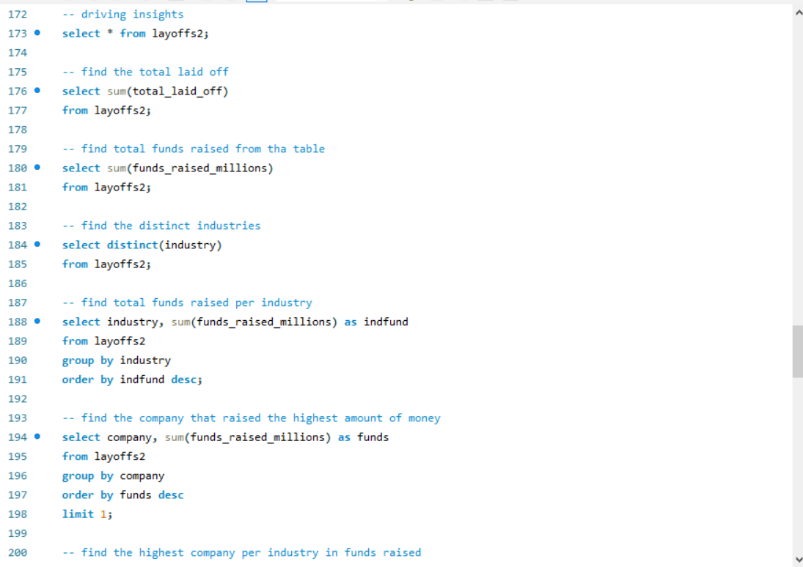

---

🧹 Global Job Layoffs — SQL Data Cleaning & Analysis

🧠 Project Overview

This project focuses on cleaning and analyzing a dataset containing records of **global job layoffs** across multiple industries and countries.
The dataset includes company details, locations, industries, number of layoffs, company stages, and total funds raised (in millions).

Using **MySQL**, the project demonstrates how to clean raw, inconsistent data, standardize formats, fill missing values, and perform exploratory data analysis to uncover key insights about the global workforce trends.

---

🎯 Objectives

1 Remove duplicate and inconsistent records from the dataset.
2 Standardize and transform data types for accuracy and usability.
3 Handle missing and null values appropriately.
4 Derive insights on layoffs by company, industry, country, and time.
5 Identify funding and layoff trends across industries.

---

🧰 Tools & Technologies

SQL (MySQL Workbench)
RDBMS: MySQL 8+
Functions Used:

  * `ROW_NUMBER()`, `TRIM()`, `STR_TO_DATE()`, `GROUP BY`, `JOIN`, `UPDATE`, `DELETE`, `ALTER`, `SUM()`, etc.

---

🧹 Data Cleaning Process

The data cleaning process followed a systematic approach:

1. Duplicate Removal

   . Used `ROW_NUMBER()` window function to identify and delete duplicate rows.
   . Created temporary tables (`layoffs1`, `layoffs2`) to ensure safe data cleaning.

2. Trimming & Standardization

   . Removed extra spaces using `TRIM()` on text columns.
   . Corrected inconsistent entries (e.g., industry names like `"crypto currency"` → `"crypto"`).
   . Removed trailing characters from country names.

3. Data Type Corrections

   . Converted the `date` column from `TEXT` to `DATE` using `STR_TO_DATE()`.
   . Standardized numeric columns (`total_laid_off`, `funds_raised_millions`) for accurate aggregation.

4. Handling Null or Blank Values

   . Set empty strings to `NULL`.
   . Filled missing `industry`, `total_laid_off`, and `percentage_laid_off` where logical matches existed using `JOIN` statements.
   . Replaced remaining nulls in numeric fields with `0` where appropriate.

5. Data Validation

   . Checked for incomplete or irrelevant rows and deleted unusable entries.
   . Verified corrections using multiple `SELECT` validation queries.


---

📊 Exploratory Analysis & Insights


After cleaning, SQL queries were used to extract valuable insights, including:
| Analysis Goal                           | SQL Summary Query                                          | Example Output / Finding                                   |
| --------------------------------------- | ---------------------------------------------------------- | ----------------------------------------
| Total layoffs globally                  | `SELECT SUM(total_laid_off)`                               | Total layoffs: *X employees*                                |
| Funds raised by industry                | `GROUP BY industry ORDER BY SUM(funds_raised_millions)`    | Tech sector raised the most funding                                   |
| Top company by funds raised             | `LIMIT 1` query                                            | Company X raised the highest funds                                     |
| Industries most affected by layoffs     | `GROUP BY industry`                                        | Consumer & Tech sectors had the most layoffs                                   |
| Preferred company location              | `GROUP BY location ORDER BY COUNT(location)`               | San Francisco had the highest company count                                     |
| Layoffs by year                         | `WHERE date LIKE '2022%'`                                  | Major layoffs occurred in 2022                                      |
| Cross-industry presence                 | `WHERE industry LIKE 'health%' OR industry LIKE 'crypto%'` | Healthcare and crypto industries span multiple countries                        |                                                            |

---

📈 Key Insights

• 	Total layoffs and funds raised across the dataset
• 	Industries most affected by layoffs
• 	Companies with highest layoffs and fundraising
• 	Geographic trends in layoffs and funding
• 	Yearly patterns and 2022-specific layoffs

---

📂 Repository Structure

```
📁 SQL-DC-IPROJECT/
│visuals/
│   └── Overview.png
|       Insights.png
|       FinalTableSample.png
|README.md
| 
|data/
│   └── layoffs.csv             
│
|scripts/
│   └── layoffs.sql  
                              
```

---

🧠 Skills Demonstrated

. SQL-based data cleaning and transformation
. Exploratory analysis and business insight extraction
. Query optimization and stepwise validation
. Attention to data consistency and quality assurance

---

📬 Contact

Name: Onagadanalyst
Role: Data & Market Analyst | Building Expertise in Augmented Analytics and AI Automation
LinkedIn: 
GitHub: https://github.com/o-danalyst
Email: onagatheanalyst@gmail.com
---

